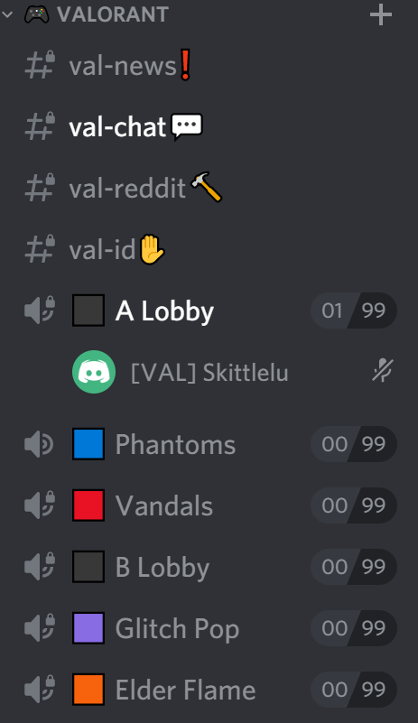

`Situation`\
Over the summer, my school's eSports club was doing a summer long tournament where people would receive points for going to weekly in-houses. The in-houses would be held over Discord and their Discord IDs would be used to keep track of attendance and update the common spreadsheet.

This is what a typical game lobby looks like. We have the general category which is Valorant in this example. We have voice channels that can be recognized by the small microphone logo.

`Problem`\
The task became repetitve as we would have to update the spreadsheet multiple times over the course of a week due to the sheer number of in-houses that we were holding. Typically, the work flow would be to copy each and every name in all the voice channels in a specific game category. Then, we would move those names to that specific game's spreadsheet and then also make edits on a general spreadsheet where all the points were kept. This can be extremely redundant and easily optimized.

`Solution`
1. Use discord.py to find the specific category channel
2. Retrieve all the voice channels in the category channel
3. Retrieve all the members currently in one of these voice channels
4. Use gspread, a Python API for Google Sheets to find the users and update their scores or create a new row for new users.
